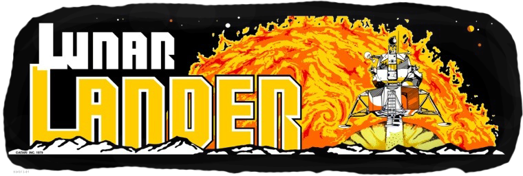

## Project report

{ width=380px }

### General informations

**For the course**:

Implementing Artificial Neural Networks (ANNs) with Tensorflow (winter term 2019/20)

**Topic**:

A2C for continuous action spaces applied on the [LunarLanderContinuous][LLC] environment from Gym OpenAI

[LLC]: https://gym.openai.com/envs/LunarLanderContinuous-v2/
