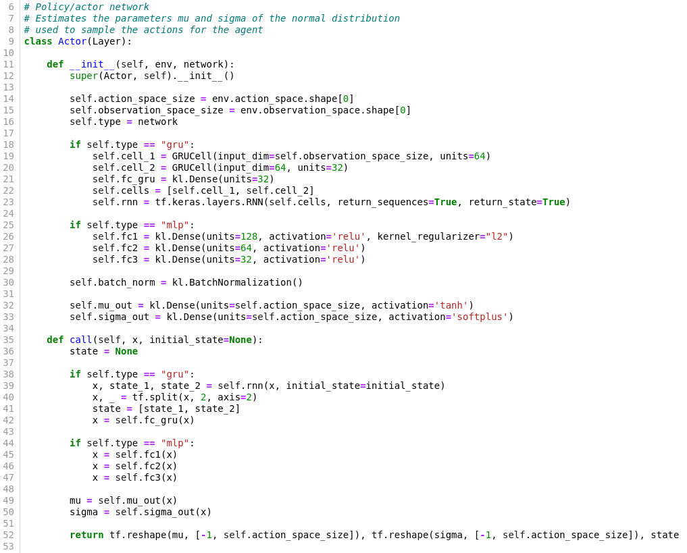
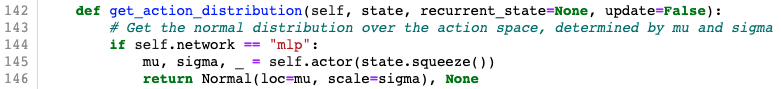

## Project report

### General informations

**For the course**:

Implementing Artificial Neural Networks (ANNs) with Tensorflow (winter term 2019/20)

**Topic**:

A2C for continuous action spaces applied on the [LunarLanderContinuous][LLC] environment from Gym OpenAI

**Participants**:

Jonas Otten  
Alexander Prochnow  
Paul Jänsch

### Outline

1. Introduction/Motivation
2. Theoretical Background
3. Project development log
4. The model and the experiment
5. Visualization and results

### 1. Introduction/Motivation

As a final project of this course one possible task was to identify an interesting research paper in the field of ANNs and reproduce the content of the paper with the knowledge gained during the course. In our case we first decided on what we wanted to implement and then looked for suitable papers on which we can base our work.  
Inspired by the [lecture about Deep Reinforcement Learning][LeonLect] (DLR) held by Leon Schmid we wanted to take the final project as an opportunity to gather some hands-on experience in this fascinating area. So Reinforcement Learning it is. But where to start? We were looking for something which offers a nice tradeoff between accessibility, challenge and chance of success. The [Gym environments][Gym] provided by OpenAI seemed to do just that. Most of them are set up and ready to run within a minute and with them there is no need to worry about how to access observations or perform actions. One can simply focus on implementing the wanted algorithm.  
Speaking of which, from all the classic DRL techniques we knew so far, the Synchronous Advantage Actor-Critic algorithm (short A2C) seemed most appropriate for the extent of the project. Challenging but doable in a few weeks. This left us with two remaining questions to answer before we could start our project.  
First, which environment exactly should our learning algorithm try to master using A2C? Since there are better solutions than A2C for environments with discrete action spaces, Leon recommended us to go with the [LunarLanderContinuous][LLC] environment.  
And second, which A2C related papers provide us with the neccessary theoretical background and also practical inspiration on how to tackle the implementation? The answer to this question we want to give in the next section about background knowledge.

### 2. Theoretical Background

In RL an agent is interacting with an environment by observing a state $s_t$ of a state space $S$ and taking an action $a_t$ of an action space $A$ at each discrete timestep $t$. Furthermore the agent receives a reward $r_t$ at particular timesteps after executing an action. The agents takes the actions accoring to a policy $\pi$. In the LunarLanderContinuous environment the agent receives a reward after each action taken.   

We assume that the environment is modelled by a Markov decision process (MDP), which consists of a state transition function $\mathcal{P}$ giving the probability of transitioning from state $s_t$ to state $s_{t+1}$ after taking action $a_t$ and a reward function $\mathcal{R}$ determining the reward received by taking action $a_t$ in state $s_t$. The *Markov property* is an important element of a MDP, that is the state transition only depends on the current state and action and not on the precending ones.  
In RL the goal is to maximize the cumulative discounted return at each timestep $t$:

$$G_t = \sum_t^{\infty}{\gamma^{t} r_t}$$

with $\gamma \in (0,1]$ at each timestep $t$. There are two estimates of the return, either the state value function $V^{\pi}(s_t)$ giving the estimated return at state $s_t$ following policy $\pi$ or the state-action value function $Q(s_t, a_t)$ giving the estimated return at state $s_t$ when taking action $a_t$ and following policy $\pi$ afterwards. In classical RL this problem is approached by algorithms which consider each possible state and action in order to find an optimal solution for the policy $\pi$. In continuous state and/or action spaces this approch is computionally too hard. 

In order to overcome this problem function approximation has been used to find a good solution for policy $\pi$, that maximizes the return $G_t$. Common function approximators are deep neural networks (DNNs), which gain raising success in RL as a way to find a good policy $\pi$ in large state and action spaces.  

A big problem in the usage of DNNs for RL is the difficulty of computing the gradient in methods, which estimate the policy $\pi_{\theta}$ with parameters $\theta$ directly. The reward function, which depends on the policy $\pi_{\theta}$, being maximized is defined by:

$$J(\theta) = \sum_{s \in S} d^{\pi}(s) V^{\pi} = \sum_{s \in S} d^{\pi}(s) \sum_{a \in A}{\pi_{\theta}(a|s) Q^{\pi}(s,a))}$$

$d^{\pi}(s)$ is the stationary distribution, that gives the probability of ending up in state $s$ when starting from state $s_0$ and following policy $\pi_{\theta}$. To compute the gradient $\nabla_{\theta}J(\theta)$ it is necessary to compute the gradient of the stationary distribution which depends on the policy and the transition function $d^{\pi}(s) = \lim_{t \to \infty}{\mathcal{P}(s|s_0, \pi_{\theta})}$, since the environment is unknown this is not possible.   
A reformulation of the gradient of the reward function called the policy gradient theorem (proof: [Sutton & Barto, 2017][PFP]) avoids the calculation of the derivative of the stationary distribution:

$$
\begin{aligned}
\nabla_{\theta} J(\theta) &= \nabla_{\theta} \sum_{s \in S} d^{\pi}(s) \sum_{a \in A}{Q^{\pi}(s,a)) \pi_{\theta}(a|s)} \\ 
&\propto \sum_{s \in S} d^{\pi}(s) \sum_{a \in A}{Q^{\pi}(s,a)) \nabla_{\theta} \pi_{\theta}(a|s)} \\
&= \mathbb{E}_{\pi}[Q^{\pi}(s,a) \nabla_{\theta} \ln{\pi_{\theta}(a|s)}]
\end{aligned}
$$

This formula holds under the assumptions that the state distribution $s \sim d_{\pi_{\theta}}$ and the action distribution $a \sim \pi_{\theta}$ follow the policy $\pi_{\theta}$ (on-policy learning). The action-state value function acts as an incentive for the direction of the policy update and can be replaced by various terms, e.g. the advantage function $A_t$.

An algorithm that makes use of the policy gradient theorem is the actor-critic method. The critic updates the parameters $w$ of a value function and the actor updates the parameters $\theta$ of a policy according to the incentive of the critic. An extension of it is the synchronous advantage actor-critic method (A2C). Here multiple actors are running in parallel. A coordinator waits until each agent is finished with acting in an environment in a specified number of discrete timesteps (synchronous). The received rewards are used to compute the cumulative discounted return $G_t$ for each agent at each timestep. No we can get an estimate of the advantage $A_t$, that is used as incentive for the update of the policy: $A^w_t = G_t - V^w_t$. The gradients get accumulated w.r.t. the parameters $w$ of the value function and $\theta$ of the policy:
$$
\begin{aligned}
d\theta &= d\theta + A_w\nabla_\theta \ln{\pi_{\theta}} \\
dw &= dw + \nabla_w(G - V_w)^2
\end{aligned}
$$
These gradients are used to update the parameters of the value function and the policy. After that all actors start with the same parameters. This algorithm is a variation of the original asynchronous actor-critic method ([A3C][A3C]), where each actor and critic updates the global parameters independently, which leads to actors and critics with different parameters.

Sources used:  
 * [the A3C paper][A3C]  
 * [Lilian Weng's blogpost about Policy Gradient Algorithms][Lil'Log]  
 * [A2C Code provided by OpenAI][A2Code]  

### Project development log

Here we desribe how we approached the given problem, name the steps we have taken and lay out the motivation for the decisions we made in the process of this project. (Readers only interested in the final result with explanations to the important code segments can skip this part and can continue with the paragraph "The model and the experiment")

Instead of directly heading into the complex case of an environment with continuous action space, we decided to first starting with a simpler version of A2C. Namely, A2C for a discrete action space and without parallelization. For this we took the [CartPole][CP] gym environment. Mastering this environment was the objective of phase 1, which also can be seen as a prephase to phase 2 (the main phase)

**Phase 1:**

* getting the gym environment to run
* setting up two simple networks for the actor and the critic
* using the actor network to run one agent for arbitrarily many episodes and save the observations made
* using the saved observations to train both actor and critic based on the estimated return
 
Even with our simple network architecure we were able to observe a considerable learning effect, finally leading to our agent mastering this simple environment. Although the training result was not stable enough (after several succesful episodes the agent started to get worse again) we decided to not optimize our setup on the CartPole environment, but instead switching to an environment with continous action space and optimizing our learning there. Which leads us to phase 2.

**Phase 2:**

* changing to the [LunarLanderContinuous][LLC] gym environment
* deviding the current jupyter notebook into seperate python files(main.py, coordinator.py, agent.py, actor.py and critic.py)
 * the agent now contains the
     * creation of the environment,
     * running an episode and saving the observations
     * computing the gradients for both networks and returning them to the coordinator
 * the coordinator
     * creates the agent
     * tells the agent to run an episode based on the current actor
     * and uses the returned gradients to update the networks   
* modifying the network architecture of the actor to match the new action space: it now has to return two pairs of mean and variance values, each pair describing one normal distribution from which we sample the action for the main and the side engine
* at this point we decided to implement parallel computing of episodes with multiple agents to speed up the learning (because up to this point we were not able to see any useful learning):
 * we looked at different parallelization packages and after some testing we decided to go with [Ray][Ray]
 * Ray allowed us to run multiple agents on our CPUs/GPUs in parallel and with this significantly boosting our learning  
 
With the speed-up provided by the parallelization and further fixes of minor but sometimes critical issues we were finally able to observe our agents learning useful behaviour in the LunarLander environment up to the point where the Lander actually stoped chrashing down on the moon every single time and made its first successful landings. That's one small step for the RL research, one giant leap for our team.  
But we were not quite satisfied with the result yet. The learning process was still very slow and so we decided to add one more ingredient: Long short-term memory or LSTM for short. Adding LSTM to the actor network is said to greatly improve its performance. Further it might enable our agents to solve other environments, like the [BipedalWalker][BiWalk], which require some kind of longer lasting memory.  
We advanced into the last phase of our project, which mainly deals with improvements like the implementation of LSTM but also with cleaning, restructuring and polishing the code to achieve its final form.
 
**Phase 3:**

* LSTM implementation:
 * adding the pre-build LSTM-Layers by Keras to the Actor network
 * expanding the parameter list of the actor's constructor such that one can choose whether the network should use the newly added LSTM layers or the previously used Dense layers
 * **(describe problems of LSTM here and write that we will not remove the LSTM code beacuse it is a nice approach and the default learning can still be done with the Dense Layers)**
* have code infer parameters from environment
* adding an ArgumentParser to the main.py to allow for different settings to be used when calling the main.py (test/training run, type of actor network, number of agents used, type of environment)
* cleaning the code:
 * removing old unused code parts
 * adding necessary comments to the code

 
### The model and the experiment

This section makes up the main part of our report. Here we will highlight and explain the important parts of our project's implementation. We are trying to present the code in the most semantic logical and intuitive order to facilitate the comprehension. The code itself is already structured into several classes and we will always indicate which class we are currently talking about.  
We are starting with the coordinator class because, as its name suggests, it organizes the use of every other class and also the whole procedure of the learning process. From there we will go step by step and jump into the other classes as they are coming up.  

*Figure 1: main.py line 28-35*

The instantiation of the coordinator happens in the main.py **(Figure 1)** and the execution of its `__init()__` method initializes everything needed for successful learning. The most crucial point in this part is probably the instantiation of the two Neural Networks which build the core of the A2C method, namely the Actor and the Critic. 

*Figure 2: coordinator.init() line 35-42*

As one can see here, network related things like the loss function and the optimizers are also created at this point. But let's take the chance to go into both classes and look at the architectures of the networks **(Figure 3 & 4)**.

The Critic:

*Figure 3: critic.py line 5-18*

The Actor:

*Figure 4: actor.py line 5-50*

This is just to gain a quick overview of the networks for now, as we will explain our choice of e.g. activation functions as they become more apparent.  
Back in the `__init()__` method of the coordinator, there is one more important step to talk about. The creation of the agents which will run on the environment in a  parallel manner. 

*Figure 5: coordinator.init() line  55-57*

The instantiation of the agents exhibits an anomaly: the keyword `.remote`. This is necessary, because the agent class is declared as a Ray remote class, which has the following implications when instantiated:  

* Instantiation must be done with `Agent.remote()` instead of `Agent()` as seen in the screenshot
* A worker process is started on a single thread of the CPU
* An Agent object is instantiated on that worker
* Methods of the Agent class called on multiple Agents are executed on their respective worker and can therefore execute in parallel, but must be called with `agent_instance.function.remote()`
* Returns of a remote function call now return the task ID, the actual results can be obtained later when needed by calling `ray.get(task_ID)`

After instantiation we assign the first agent to be the "chief" **(Figure 5)**. His environment will be rendered during training, while the environments of the other agents will run in the background. This adds a fun way to watch the performance of our AI, other than graphs and numbers (not that those are not fun, too).  

Besides the Ray specific specialties, the agent class still has a normal `__init()__` method on which we want to have a short glance now:

*Figure 6: agent.init() line 9-22*

Noteworthy here is the creation of the OpenAI Gym environment in which the agent will act **(Figure 6 line 11)** and the instantiation of the agent's memory **(Figure 6 line 22)**. The memory is represented as an object of our Memory class. As expected an object of this class is responsible for storing the observations an agent makes temporally. This includes states visited, actions taken, rewards received, information whether a terminal state is reached and, not being an observation in particular, a return estimate. We will have a look at important methods of the Memory class when we are dealing with the agents executing actions and making observations.

The rest of the coordinator's `__init()__` handles the preparation of the tensorboard in order to be able to inspect the training progress.  
Now that our coordinator is fully operational we can start the training by calling its `train()` method in the main.py **(Figure 1 line 35)**.   
This method is the heart of the coordinator and will be assisted by quite a lot of helper methods and also some other classes we did not talked about in detail yet. We will go through all of them and explain their use in the order they are needed in the `train()` method.  

*Figure 7: coordinator.train() line 67-74*

First, we advance the environments a number of timesteps equal to our hyperparameter `num_steps` by calling `step_parallel(t)` accordingly **(Figure 7 line 73-74)**. Then, in later parts of the `train()` method, we use the collected observations to update the networks. This way we update the network parameters only every `num_steps` (e.g. 32) timesteps. Before we can get into how we update the networks though, we must first have our agents act in the environment and return observations to us. This is the purpose of the `step_parallel(t)` method. It advances all environments from timestep t to t+1 by observing the current state and then computing an action to perform **(Figure 8)**.

*Figure 8: coordinator.step_parallel() line 129-139*

Observing the current states of the environments of multiple agents can be done in parallel by calling the `agent.observe()` function on all agents **(Figure 8 line 132)**. Being a remote function, our list comprehension will return a list of task IDs and not the actual states, therefore we must call `ray.get()` to obtain them. Taking a look at the `observe()` function **(Figure 9)** we notice that if we are at the start of a new update, it will reset the agents memory, since we only want to take observations made in the current update cycle into account for the current network update **(Figure 9 line 26-27)**. We will elaborate on the memory class in the coming section. For now, all we want is the current state, which is stored in the `self.state` attribute of the agent. If the previous episode was finished the environment will be reset and the attribute will instead contain the initial state of the new episode **(Figure 9 line 30-31)**.

*Figure 9: agent.observe() line 24-39*

Returning the current state of every agent to the coordinator, we are now ready to compute our next action for each agent. As described previously: In Lunar Lander, our agent's action consists of two values, one controlling the main engine, the other the side engines. The values can take on virtually any real number within [-1, 1]. We sample these values from two normal distributions per agent **(Figure 8 line 133-135)**, each with parameters mu and sigma, denoting the location and scale of the distribution. These parameters (one mu and sigma for the main engine distribution and one mu and sigma for the side engines distribution per agent) are the output of our Actor neural network. To compute them, we call the `get_action_distribution()` function **(Figure 10)**, which passes the current states of all environments to the actor network **(Figure 4)**. It returns the mentioned mus and sigmas, which we use to create normal distribution objects **(Figure 10 line 145)** that will now be sampled from **(Figure 8 line 135)**.

*Figure 10: coordinator.get_action_distribution() line 141-145*

At this point the reasons for our architectural choices for the actor network become apparent: The tanh of the mu output layer **(Figure 4 line 27)** keeps the center of our normal distributions, i.e. the average of our sampled values within [-1, 1], which is useful since this is exactly the action space. Similarly for the sigma output layer **(Figure 4 line 28)**, a softplus activation ensures that the mathematical restrictions of the standard deviation are upheld, namely $\sigma \ge 0$.  

Lastly, to complete our step in the environment, we execute the computed actions **(Figure 8 line 138)**. A deep dive into the agent's execute function is required before we return the agent's memories to the coordinator. That is, because we have to form the agent's memories first. Let us take a look how this is done.

*Figure 11: agent.execute() line 41-59*

The agent performs the action given on the environment and stores the resulting state, reward and done flag returned by the environment, then updates the internal state `self.state` and the finished flag **(Figure 11 line 50-53)**.  
His observations are stored by the memory object instantiated from our Memory class (memory.py). It is initialized in the agents `__init__` as seen before **(Figure 6 line 22)** and posseses numpy arrays to store states, actions, rewards, estimated returns and terminal booleans denoting whether a terminal state is reached. The agents memory starts of empty **(Figure 12 line 10-15)**. Observations can be stored in the arrays via the index representing the timesteps **(Figure 12 line 17-22)**   
   
   
*Figure 12: memory.py line 5-26*
   
Now that the memory of the agents are filled with the exciting experiences of one timestep, they are eager to return them to the coordinator. But we have taught them well, so that they will only return them to the coordinator when the required `num_steps` is reached **(Figure 11 line 56-59)**. Until then they repeat the observe and execute routine and only afterwards collectively return a list containing every agent's memory object to the coordinator.
Now it is time for the coordinator to utilize these memories to make the agents better.

**TODO**:  

we now compute the discounted cummulative return for each memory object and store it in the attribute self.estimated_return **(compute_discounted_cum_return of memory.py)**  
   * **(line 75-76 disc_returns + sum(memories))** We then concatenate all the made observations accross all agents.

* get_mean_gradients() in line 79 of coordinator  
   * **(coordinator.py line 152-157)**
   * compute_gradients()
   * actor_loss()
   * Adding the entropy term to the actor loss has been found to improve exploration, minimizing the risk of convergence to an only locally optimal policy ([A3C paper][A3C] page 4). This adds a new hyperparameter, the entropy coefficient, which balances the amount of exploration. **(coordinator entropy() )**
   
* apply_gradients to the networks in line 80-81

* the part storing summary statistics  

* the part with checkpoints

**how to run training and testing?**
 
### Visualization and results

...

[LLC]: https://gym.openai.com/envs/LunarLanderContinuous-v2/
[CP]: https://gym.openai.com/envs/CartPole-v1/
[Ray]: https://ray.io/
[Lil'Log]: https://lilianweng.github.io/lil-log/2018/04/08/policy-gradient-algorithms.html
[A2Code]: https://github.com/openai/baselines/blob/master/baselines/a2c/a2c.py
[A3C]: https://arxiv.org/pdf/1602.01783.pdf
[Gym]: https://gym.openai.com/
[LeonLect]: https://studip.uni-osnabrueck.de/sendfile.php?type=0&file_id=f0d5efee6a2faf80610f2540611efb47&file_name=IANNwTF_L12_Reinforcement_Learning.pdf
[PFP]: http://incompleteideas.net/book/bookdraft2017nov5.pdf 
[BiWalk]: http://gym.openai.com/envs/BipedalWalker-v2/
